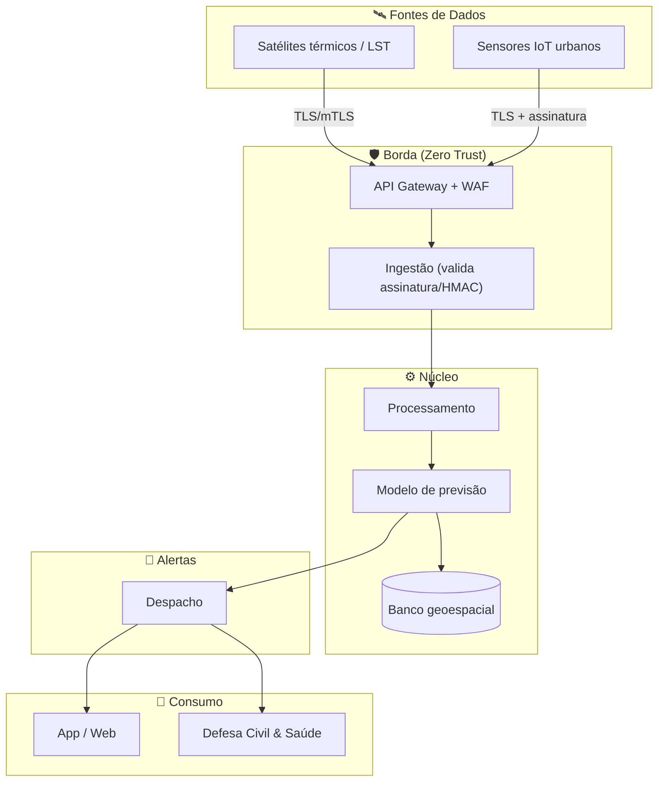

# 🛰️ Sentinela Orbital

> Plataforma de **monitoramento e alerta precoce de ondas de calor extremo** que combina **dados orbitais** (satélites de temperatura de superfície) com **sensores IoT terrestres** para avisar a Defesa Civil, o sistema de saúde e a população **antes** que o calor vire emergência.


Este repositório é o **entregável de Cybersecurity** da Global Solution (3ES — 1º semestre/2026). Ele documenta a **camada de segurança** que dá longevidade e confiança à Sentinela Orbital, indo do **threat modeling** (pensar como atacante) à **blindagem** (pensar como defensor).

---

## 🌍 O problema

Ondas de calor extremo são um dos desastres climáticos que mais matam — de forma silenciosa e desigual. Idosos, crianças e bairros sem arborização ("ilhas de calor") são os mais expostos, e o alerta costuma chegar **tarde** e **sem granularidade local**.

## 💡 A solução

A Sentinela Orbital cria uma camada de inteligência sobre dados que já existem no espaço:

1. **Coleta orbital** — temperatura de superfície (LST) de satélites (NASA VIIRS/MODIS, Copernicus Sentinel-3, GOES-16).
2. **Calibração local** — sensores IoT urbanos confirmam a leitura no nível do bairro.
3. **Detecção & previsão** — um modelo identifica e projeta janelas de risco por região.
4. **Alerta acionável** — ao cruzar o limiar, dispara avisos segmentados (app, SMS/push e API para Defesa Civil e Saúde).

## 🏗️ Arquitetura



> 🧠 Por que segurança é o alicerce: a Sentinela é um sistema de **segurança pública**. Silenciar um alerta real ou forjar um falso não é "perda de dados" — é **risco à vida**. E ela trata dados pessoais sensíveis (localização e saúde), sob a **LGPD**.

---

## 🔐 A camada de segurança (este entregável)

A análise completa está em [`docs/seguranca/`](docs/seguranca/) e a política de segurança em [`SECURITY.md`](SECURITY.md).

| Pilar | Conteúdo | Pts | Documento |
|---|---|:--:|---|
| **1. Threat Modeling** | Ativos críticos + 6 vetores de ataque (STRIDE) | 2 | [01-threat-modeling.md](docs/seguranca/01-threat-modeling.md) |
| **2. Arquitetura de Segurança** | Acesso (MFA, RBAC), proteção de dados (TLS/AES), infra (Zero Trust) | 3 | [02-arquitetura-de-seguranca.md](docs/seguranca/02-arquitetura-de-seguranca.md) |
| **3. Governança & Compliance** | ISO 27001 (gestão de risco) + LGPD (privacidade) | 2 | [03-governanca-e-compliance.md](docs/seguranca/03-governanca-e-compliance.md) |
| **4. Resiliência** | Plano de resposta a incidentes (NIST 800-61) | 3 | [04-plano-de-resposta-a-incidentes.md](docs/seguranca/04-plano-de-resposta-a-incidentes.md) |
| **Red 🔴 vs Blue 🔵** | Atacando e blindando a própria ideia | — | [05-red-team-blue-team.md](docs/seguranca/05-red-team-blue-team.md) |

### Como atendemos aos critérios

- **Aplicabilidade** → os controles são desenhados sobre a arquitetura real acima.
- **Profundidade técnica** → STRIDE, Zero Trust, ISO 27001, LGPD e o ciclo NIST de resposta a incidentes.
- **Coerência** → a [matriz ameaça → controle](docs/seguranca/05-red-team-blue-team.md#matriz-ameaça-controle) liga **cada risco** à sua mitigação.

---

## 📁 Estrutura do repositório

```
sentinela-orbital/
├── README.md          ← você está aqui
├── SECURITY.md        ← política de segurança (como reportar vulnerabilidades)
├── LICENSE
└── docs/
    └── seguranca/
        ├── 00-visao-geral.md
        ├── 01-threat-modeling.md
        ├── 02-arquitetura-de-seguranca.md
        ├── 03-governanca-e-compliance.md
        ├── 04-plano-de-resposta-a-incidentes.md
        └── 05-red-team-blue-team.md
```

> 📝 A base de conhecimento completa (o "cérebro" do projeto, com ~27 notas interligadas) é mantida em paralelo num vault **Obsidian**.

---

## 👥 Equipe & disciplina

- **Disciplina:** Cybersecurity — Global Solution (3ES, 1º semestre / 2026)
- **Projeto:** Sentinela Orbital
- **Integrantes:** _preencher_

## 📄 Licença

Distribuído sob a licença [MIT](LICENSE).
