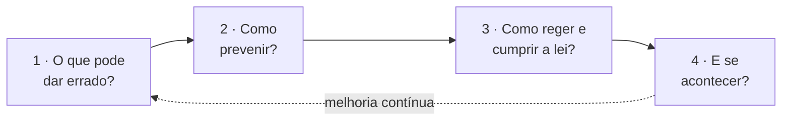

# 00 · Visão Geral da Segurança

Capítulo de **Cybersecurity** da Sentinela Orbital — a camada que dá **longevidade e confiança** ao projeto. A entrega cobre os **4 pilares** do enunciado (10 pontos).

## Mapa do capítulo

| # | Pilar | Documento | Pts |
|---|---|---|:--:|
| 1 | Threat Modeling | [01-threat-modeling.md](01-threat-modeling.md) | 2 |
| 2 | Arquitetura de Segurança | [02-arquitetura-de-seguranca.md](02-arquitetura-de-seguranca.md) | 3 |
| 3 | Governança & Compliance | [03-governanca-e-compliance.md](03-governanca-e-compliance.md) | 2 |
| 4 | Resiliência e Continuidade | [04-plano-de-resposta-a-incidentes.md](04-plano-de-resposta-a-incidentes.md) | 3 |
| — | Red Team vs Blue Team | [05-red-team-blue-team.md](05-red-team-blue-team.md) | — |

## A lógica da entrega

Primeiro **atacamos a própria ideia** (Red Team) para achar fraquezas; depois **blindamos** (Blue Team). A ponte entre as duas visões é a **matriz ameaça → controle**, que garante a coerência.

## Contexto que molda as prioridades

A Sentinela é um sistema de **alerta de emergência**. Por isso, na tríade **CIA** (Confidencialidade, Integridade, Disponibilidade), os pesos se invertem em relação à TI comum:

- **Integridade** 🔴 — um dado de temperatura adulterado leva a uma decisão de saúde pública errada.
- **Disponibilidade** 🔴 — o alerta precisa chegar exatamente no pico do calor.
- **Confidencialidade** 🔴 — trata dados sensíveis de saúde e localização (LGPD).

## Critérios de avaliação

| Critério | Como atendemos |
|---|---|
| **Aplicabilidade** | Controles desenhados sobre a arquitetura real (ver README). |
| **Profundidade técnica** | STRIDE, Zero Trust, ISO 27001, LGPD, NIST 800-61. |
| **Coerência** | Matriz ameaça → controle liga cada risco à sua mitigação. |
