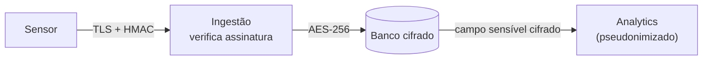

# 02 · Arquitetura de Segurança (Controles)

> **Pilar 2 — 3 pontos** · Controles de acesso, proteção de dados e segurança da infraestrutura. Filosofia central: **Zero Trust** — "nunca confie, sempre verifique".

## 2.1 Controles de Acesso

### Identidade e autenticação
- **Cidadãos:** OIDC/OAuth2 com MFA opcional.
- **Operadores e admins:** **MFA obrigatório** com fator forte (TOTP ou **FIDO2/WebAuthn**) → fecha o **V4**.
- **Sistemas/serviços:** identidade por serviço com **mTLS** e **tokens de curta duração**, nunca senha fixa.
- **Parceiros (Defesa Civil/Saúde):** **API keys + mTLS**, escopo restrito.

### Autorização — privilégio mínimo (RBAC)

| Papel | Pode | Não pode |
|---|---|---|
| Cidadão | Ver dados públicos, gerir o próprio perfil | Ver dados de outros |
| Parceiro | Consumir API de alertas da sua região | Acessar PII bruta |
| Operador | Monitorar, investigar | Disparar alerta sozinho |
| Admin | Configurar, gerir acessos | Acessar PII sem justificativa |

> **Controle crítico — dupla aprovação (two-person rule):** disparar um alerta em massa exige **duas identidades distintas**. Transforma "uma conta comprometida = pânico" em "duas contas comprometidas = pânico".

## 2.2 Proteção de Dados

### Em trânsito
- **TLS 1.3** em toda comunicação externa; **mTLS** serviço-a-serviço e nos links de ingestão → fecha o **V1**.
- **Assinatura/HMAC** na telemetria: a ingestão **rejeita** o que não bate → ataca **V1** e **V2**.

### Em repouso
- **AES-256** no banco, backups e storage.
- **Criptografia de campo** para localização + saúde.
- **Argon2id** para hash de senhas (com salt) — nunca texto puro.
- **Gestão de chaves** com KMS/HSM e rotação.

### Minimização e anonimização (ponte com a LGPD)
Coletar o mínimo · pseudonimizar localização para análise · anonimizar/agregar dados públicos · retenção com prazo de expurgo.

### Segredos
Chaves de API em **cofre** (ex.: Vault), nunca no repositório; **scanning de segredos** no CI/CD → mitiga **V6**.

## 2.3 Segurança da Infraestrutura

### Zero Trust na prática
Sem rede confiável por padrão · **microssegmentação** (ingestão, núcleo, alertas e PII isolados) · **assume breach**.

### Perímetro e disponibilidade (anti-V3)
- **WAF + CDN/anycast + rate limiting** absorvem e filtram tráfego.
- **Autoescalonamento** para o pico legítimo durante uma onda de calor.
- **Canais redundantes** de alerta (push, SMS, API): se um cai, o aviso ainda sai.

### Integridade do ambiente
Infra as Code versionada · ambientes **imutáveis** · CI/CD seguro (**SAST, DAST, SCA**, scan de segredos, **SBOM** + artefatos assinados) → fecha **V6** · scan de imagens · patching automatizado.

### Monitoramento e detecção
**Logs centralizados + SIEM** com alertas de anomalia (pico de leituras fora da curva = possível **V2**) · **IDS/IPS** · **trilhas de auditoria imutáveis (WORM)** → garante o não-repúdio (o "R" do STRIDE).

➡️ Como esses controles neutralizam cada ataque: [05 · Red Team vs Blue Team](05-red-team-blue-team.md).
