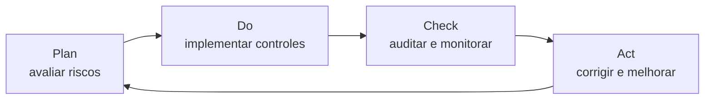

# 03 · Governança e Compliance

> **Pilar 3 — 2 pontos** · Alinhamento normativo (ISO 27001) + privacidade (LGPD).

## 3.1 Alinhamento Normativo — ISO/IEC 27001

A Sentinela adota um **SGSI** (Sistema de Gestão de Segurança da Informação) com o ciclo **PDCA**: segurança é processo contínuo, não evento único.

### Gestão de Riscos (núcleo da norma)
1. **Identificar** ativos e riscos → já feito no [threat modeling](01-threat-modeling.md).
2. **Avaliar** risco = probabilidade × impacto.
3. **Tratar** — mitigar / transferir / aceitar / evitar.
4. **Registrar** na **Declaração de Aplicabilidade (SoA)** os controles do **Anexo A**.

### Mapeamento ao Anexo A

| Tema (Anexo A) | Como a Sentinela atende |
|---|---|
| Políticas / organização | Política de SI e papéis definidos |
| Controle de acesso | MFA, RBAC, privilégio mínimo (pilar 2.1) |
| Criptografia | TLS 1.3, AES-256, gestão de chaves (pilar 2.2) |
| Segurança de operações | Logs, SIEM, hardening (pilar 2.3) |
| Fornecedores | Segurança de provedores de satélite e nuvem |
| Gestão de incidentes | Plano de resposta (pilar 4) |
| Continuidade | Backups, DR, redundância de canais |

Auditorias internas + análise crítica geram o "Act" do PDCA. Incidentes reais viram lição aprendida e atualizam o modelo de ameaças.

## 3.2 Privacidade — LGPD

A Sentinela trata **localização** e **vulnerabilidade de saúde** — dado pessoal **sensível** (art. 5º, II da LGPD), com proteção reforçada.

### Bases legais

| Tratamento | Base legal |
|---|---|
| Alerta de emergência à população | Proteção da vida + políticas públicas (art. 7º, VII/IX) |
| App do cidadão (perfil) | Consentimento (art. 7º, I) |
| Estatística climática pública | Dados anonimizados (art. 12) |

### Princípios aplicados (art. 6º)
Finalidade · adequação · **necessidade (minimização)** · transparência · **segurança** · prevenção.

### Direitos do titular (art. 18)
Acessar · corrigir · **excluir** · portar · revogar consentimento.

### Estrutura de governança
- **DPO/Encarregado** nomeado e publicado.
- **RIPD/DPIA** para o tratamento de localização e saúde (alto risco).
- **Privacy by design & by default** — privacidade como requisito de arquitetura.
- **Notificação de incidente:** vazamento de PII (**V5**) dispara comunicação à **ANPD** e aos titulares (integrado ao [plano de resposta](04-plano-de-resposta-a-incidentes.md)).

> A ISO 27001 dá o **método técnico**; a LGPD dá a **obrigação jurídica**. Juntas, sustentam a confiança que faz as pessoas usarem a plataforma.
