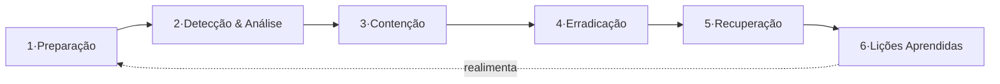

# 04 · Plano de Resposta a Incidentes (PRI)

> **Pilar 4 — 3 pontos** · O que acontece se a Sentinela sofrer uma invasão. Seguimos o ciclo do **NIST SP 800-61**.

## 1. Preparação
Runbooks por cenário · **CSIRT** com papéis definidos · contatos (incl. **ANPD** e **Defesa Civil**) · backups cifrados e testados · ambientes imutáveis (IaC) · detecção pronta (SIEM, IDS/IPS).

## 2. Detecção & Análise
Gatilhos: alerta do SIEM, leitura de sensor fora da curva, pico anômalo de tráfego, denúncia. Classifica-se a **severidade** — um alerta falso disparado à população é **Sev-1** (risco à vida).

---

## Cenário-exemplo (Sev-1): sequestro do Motor de Alertas (V4)

> **Detecção:** o SIEM acusa um disparo de alerta em massa **sem a dupla aprovação** obrigatória.

### 3. Contenção
- **Imediata:** revogar tokens/sessões do operador comprometido; **isolar** o segmento do motor (microssegmentação).
- **Curto prazo:** acionar o *kill-switch* do despacho automático e emitir **comunicado oficial de correção** pelos canais redundantes.
- Preservar evidências (snapshots, logs WORM).

### 4. Erradicação
- Achar a **causa-raiz** (ex.: phishing → conta sem MFA forte).
- Remover o acesso do atacante, **rotacionar todas as credenciais/chaves**, fechar a vulnerabilidade.
- Varredura por persistência (backdoor, conta fantasma).

### 5. Recuperação
- Restaurar o motor a partir de imagem **íntegra e assinada**; reativar o despacho **gradualmente** com monitoramento reforçado.
- Confirmar que a regra de **dupla aprovação** voltou ativa.

### 6. Lições Aprendidas
- Post-mortem **sem culpabilização**; atualizar o modelo de ameaças e os controles.
- Se houve vazamento de PII, acionar o fluxo da LGPD → notificar **ANPD** e titulares.

---

## Continuidade do negócio (BCP/DR)

| Métrica | Meta | Como |
|---|---|---|
| **RTO** (tempo para voltar) | 1h (alertas) | IaC + imagens imutáveis |
| **RPO** (perda máx. de dados) | 15min | Backups incrementais cifrados |
| **Disponibilidade do alerta** | redundância | push + SMS + API |

> **Resultado:** mesmo sob ataque, a Sentinela **degrada com segurança** (fail-safe): na dúvida, prioriza não silenciar um alerta real e não disparar um falso. Resiliência é o que dá longevidade e confiança ao projeto.
